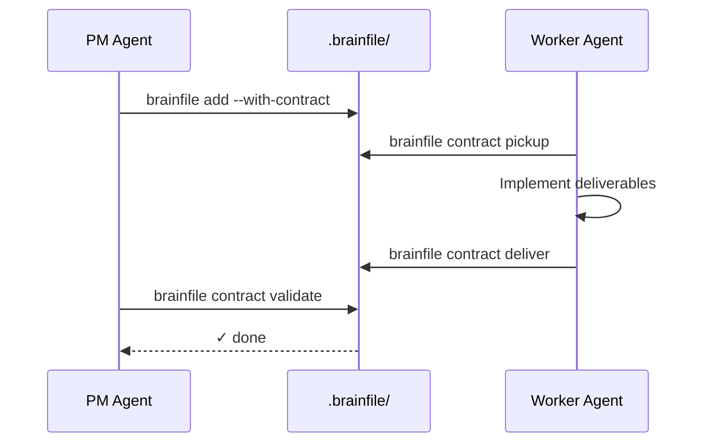

# Quick Start

::: tip Bootstrap with an Agent
Paste this URL into any agent chat and tell it to set up brainfile:
```
https://brainfile.md/llms-install.txt
```
The agent gets install commands, MCP config, CLI reference, and the contract workflow in one document.
:::

Get a task board in your project in under a minute.

## 1. Install

```bash
npm install -g brainfile
```

## 2. Initialize

```bash
brainfile init
```

This creates the `.brainfile/` directory with:
- `.brainfile/brainfile.md` — Board configuration (columns, types)
- `.brainfile/board/` — Active task files
- `.brainfile/logs/` — Completion history (`ledger.jsonl`) and archives

`
.brainfile/
├── brainfile.md    ← Board config (columns, types)
├── board/          ← Active task files go here
└── logs/           ← Completed history (ledger and archived files)
`

<ArchitectureDiagram />

Default columns are `To Do` and `In Progress`.

## 3. Use It

::: tip Interactive TUI
```bash
brainfile          # No arguments launches the TUI
brainfile tui      # Explicit subcommand also works
```
Navigate with keyboard: `Tab` for columns, `j`/`k` to move, `Enter` for detail, `?` for help, `q` to quit.
:::

::: tip CLI Commands
```bash
brainfile list                              # See all tasks
brainfile add --title "My first task"       # Add a task
brainfile move --task task-1 --column in-progress  # Move columns
brainfile complete --task task-1            # Complete (appends to ledger.jsonl and archives)
```
:::

---

## Add AI Integration

Want your AI assistant to manage tasks directly? Add this to `.mcp.json` in your project:

```json
{
  "mcpServers": {
    "brainfile": {
      "command": "npx",
      "args": ["brainfile", "mcp"]
    }
  }
}
```

Works with Claude Code, Cursor, Cline, and any MCP-compatible tool.

::: tip What can AI do with this?
Your assistant can now list tasks, create new ones, move them between columns, update priorities, and manage subtasks — all without you copy-pasting anything.
:::

---

## First project (you talk, the agent drives)

You do **not** need to type every `brainfile` CLI command yourself. After install + MCP (steps above), describe what you want in chat — the agent creates board tasks, implements the code, and updates status through tools.

Example: ask your agent for a tiny calculator:

> Set up brainfile if it isn't already, then build a simple calculator web page (`index.html` + vanilla JS) with add, subtract, multiply, and divide. Track the work on the board with a contract: deliverables for the HTML/JS files, and validate with a quick smoke check (e.g. open the page or a small node script that exercises the math). When you're done, mark the contract delivered so I can validate.

What typically happens next (via MCP or CLI — you stay in the conversation):

1. **Board** — `brainfile init` (if needed), then a task with a contract (deliverables + validation).
2. **Build** — the agent implements the calculator files.
3. **Hand-off** — `contract deliver`, then you (or a PM agent) run `contract validate` / `complete`.

Same pattern scales to a notepad app, a small API, or a multi-agent split (Claude plans contracts; a cheaper/local model implements). For roles and rework loops, see [Agent Workflows](/guides/agent-workflows).

::: tip Still useful to know the CLI
The TUI and CLI are for *you* when you want to inspect or nudge the board. Day-to-day agent work goes through MCP tools — the CLI examples elsewhere in these docs are the same operations, not a requirement that you type them by hand.
:::

---

## Agent Coordination (Optional)

Brainfile allows you to create **Contracts** for your AI assistants. A contract defines exactly what an agent needs to deliver.

### 1. Create a task with a contract
```bash
brainfile add --title "Create API docs" \
  --with-contract \
  --deliverable "docs/api.md" \
  --validation "npm run docs:build"
```

### 2. How agents use it
When an AI agent (like Claude or Cursor) picks up this task, it will see the structured `deliverables` and `validation` commands. This ensures the agent produces exactly what you need.



---

## Next Steps

- [Getting Started with Contracts](/guides/getting-started-with-contracts) — Define deliverables for AI agents
- [AI Agent Integration](/agents/integration) — MCP, hooks, and how brainfile relates to `AGENTS.md`
- [CLI Commands](/tools/cli) — Full command reference and TUI guide
- [MCP Integration](/tools/mcp) — Connect your AI assistant directly
- [Board Format Reference](/reference/protocol) — File format and schema details
